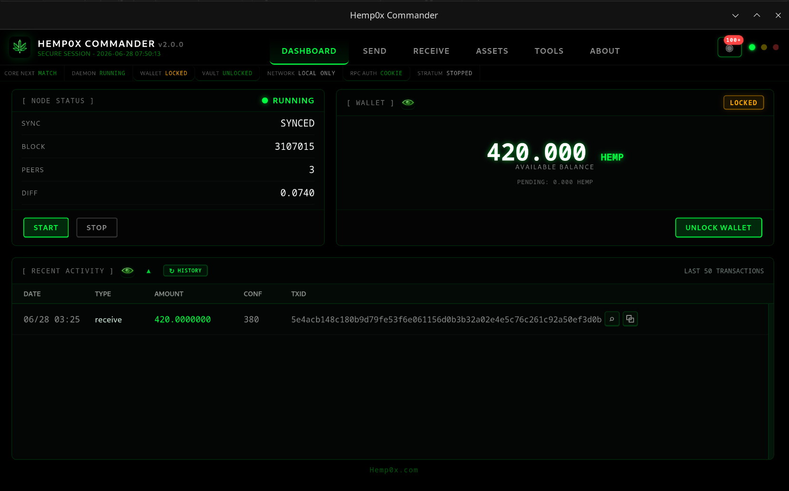
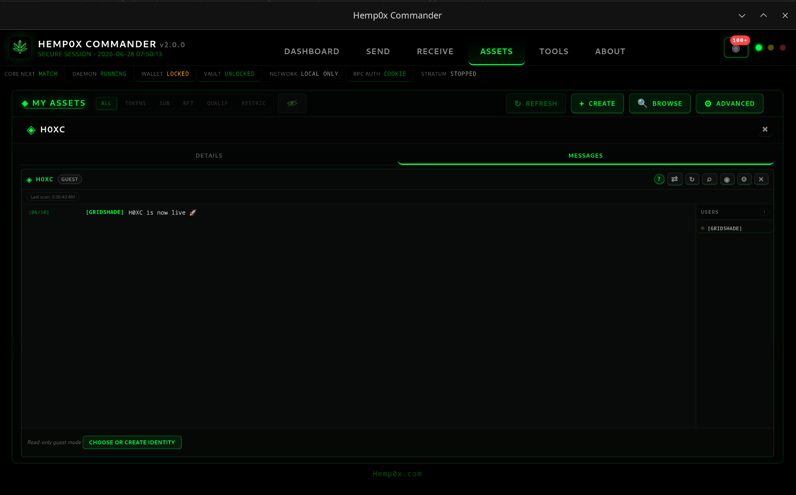
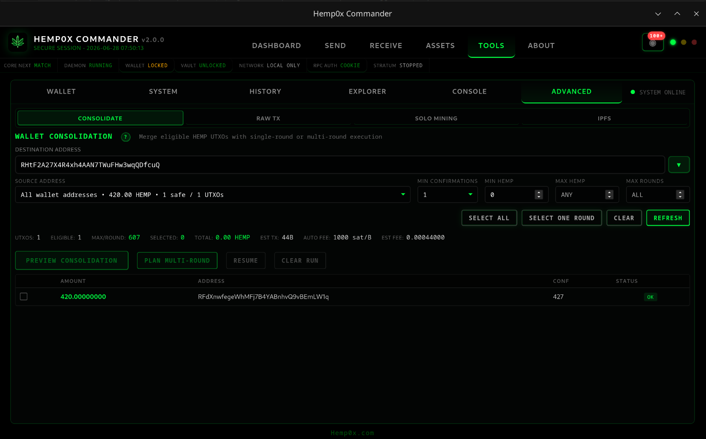
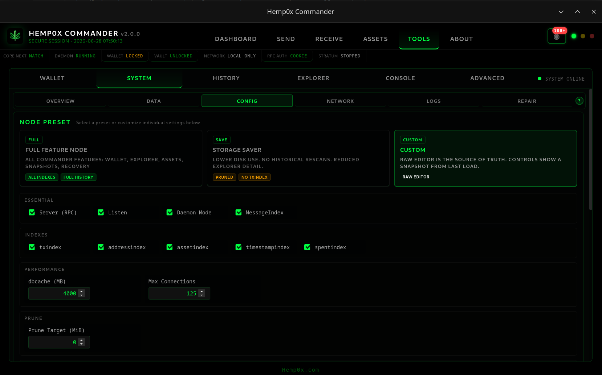

# Hemp0x Commander

<p align="center">
  <a href="https://hemp0x.com">
    
  </a>
</p>

<h3 align="center">A desktop control center for Hemp0x Core Next</h3>

<p align="center">
  Run your node, manage wallets, work with assets, inspect chain data, and use H0XC community chat from one local app.
</p>

<p align="center">
  <a href="https://hemp0x.com"></a>
  <a href="https://github.com/hemp0x/hemp0x-commander/releases/tag/v2.0.0"></a>
  <a href="https://discord.gg/FMEKJUwcsu"></a>
</p>



## What Commander Does

Hemp0x Commander is a non-custodial desktop app for the Hemp0x blockchain. It controls bundled Hemp0x Core Next binaries through local authenticated RPC, so your wallet files and vault files stay on your machine.

Commander 2.0 is a major rebuild. It adds portable Hemp0x Vault wallets, Core Next 4.8 integration, local chain tools, H0XC chat support, wallet consolidation, a local explorer, and smarter node configuration.

## Commander 2.0 Highlights

- **Bundled Core Next 4.8.0.0** with version matching and sidecar validation.
- **Hemp0x Vault wallets** with portable BIP39 primary wallet records that can move between Commander and WebCom.
- **Legacy wallet support** for `wallet.dat`, runtime wallet files, Core migration envelopes, and backup recovery.
- **Wallet creation and recovery** with 12 or 24 word recovery phrases, vault storage, Core restore, phrase confirmation, and recovery-history tools.
- **Local PIN unlock** for the Core runtime wallet on trusted devices.
- **Node dashboard** with start, stop, sync state, reindex state, balance, activity, and daemon health.
- **Smart config editor** for full node, storage saver, messageindex, txindex, addressindex, assetindex, pruning, RPC, ZMQ, addnodes, and raw `hemp.conf` edits.
- **Snapshot install and repair tools** for data directory maintenance and recovery.
- **Asset tools** for owned assets, network browsing, transfers, rewards, asset messages, and raw transaction work.
- **Wallet consolidation** for selecting eligible UTXOs and planning single-round or multi-round consolidation.
- **Local explorer** for transactions, addresses, blocks, assets, UTXOs, wallet history, and copy/lookup actions without third-party explorer requests.
- **Console and raw tools** for CLI/RPC commands, transaction decode, transaction builder, mempool checks, and advanced troubleshooting.
- **H0XC community chat** with messageindex support, H0XSHT message parsing, message recovery, local moderation, history windows, and guest read mode.

## Screenshots

### Dashboard


### H0XC Community Chat



### Wallet Consolidation



### System Configuration



## Downloads

Release builds are published on the GitHub releases page:

<https://github.com/hemp0x/hemp0x-commander/releases/tag/v2.0.0>

### Windows

Download the Windows portable zip, extract it to a writable folder, then run:

```text
hemp0x-commander.exe
```

Windows SmartScreen or antivirus products may warn on unsigned builds. Verify the checksum from the release notes before running the app.

### Linux

Download the universal AppImage, make it executable, then run it:

```bash
chmod +x Hemp0x_Commander_2.0.0_Universal_Linux_x86_64.AppImage
./Hemp0x_Commander_2.0.0_Universal_Linux_x86_64.AppImage
```

If your distribution blocks AppImage mounting, run:

```bash
APPIMAGE_EXTRACT_AND_RUN=1 ./Hemp0x_Commander_2.0.0_Universal_Linux_x86_64.AppImage
```

## Before You Use It

Commander is non-custodial. That means you control the files and you are responsible for backups.

- Back up `wallet.dat` before legacy wallet work.
- Back up Hemp0x Vault files before vault migration, import, export, or recovery work.
- Write down recovery phrases offline.
- Verify destination addresses before sending.
- Keep a copy of important config and data directory backups before repair or reindex operations.

## Core Next and RPC

Commander is built for Hemp0x Core Next and talks to it through local RPC. Cookie auth is preferred. If your `hemp.conf` still uses static `rpcuser` and `rpcpassword`, Commander can show guidance for switching back to cookie auth.

Common local files:

- `wallet.dat`: legacy Core wallet file.
- `vault.json`: portable Hemp0x Vault file.
- `hemp.conf`: Core configuration.
- `.cookie`: local RPC authentication cookie created by Core while the daemon is running.

## Building From Source

Prerequisites:

- Node.js 18 or newer
- Rust stable
- Hemp0x Core Next release artifacts for the target platform

```bash
npm install
npm run stage:core-next
npm run tauri build
```

For release builds, use the documented release flow:

- [Build guide](docs/BUILDING.md)
- [Release build guide](docs/RELEASE_BUILDING.md)
- [Commander 2.0 release notes](docs/releases/hemp0x-commander-2.0.0.md)

## Project Notes

Commander is a local control app. It does not custody funds and it does not replace your wallet backups. The bundled Core Next daemon remains the source of truth for chain state, wallet state, and consensus rules.

Bug reports and testing feedback are welcome in the Hemp0x Discord:

<https://discord.gg/FMEKJUwcsu>

## License

See the repository license and release notes for current distribution terms. Community testing, issues, documentation updates, and pull requests are welcome.

<p align="center">
  <a href="https://hemp0x.com">hemp0x.com</a>
</p>
